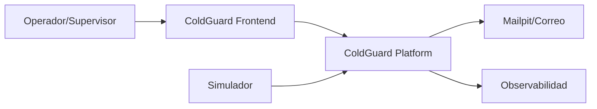
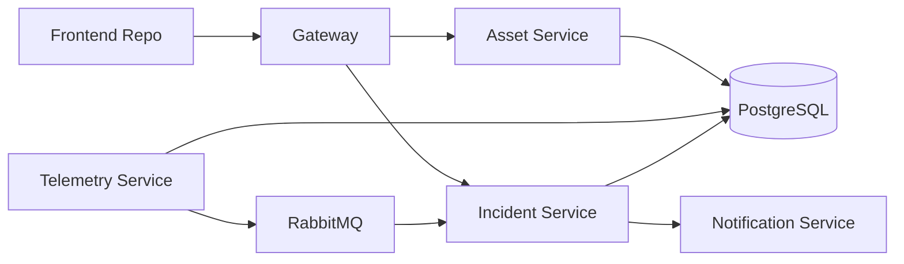

# Modelo C4

## Contexto

```mermaid
flowchart LR
  User[Operador/Supervisor] --> FE[ColdGuard Frontend]
  FE --> BE[ColdGuard Platform]
  Simulator[Simulador] --> BE
  BE --> Mail[Mailpit/Correo]
  BE --> Obs[Observabilidad]
```

## Contenedores

```mermaid
flowchart LR
  FE[Frontend Repo] --> GW[Gateway]
  GW --> AS[Asset Service]
  GW --> IS[Incident Service]
  TS[Telemetry Service] --> MQ[RabbitMQ]
  MQ --> IS
  IS --> NS[Notification Service]
  AS --> DB[(PostgreSQL)]
  TS --> DB
  IS --> DB
```
