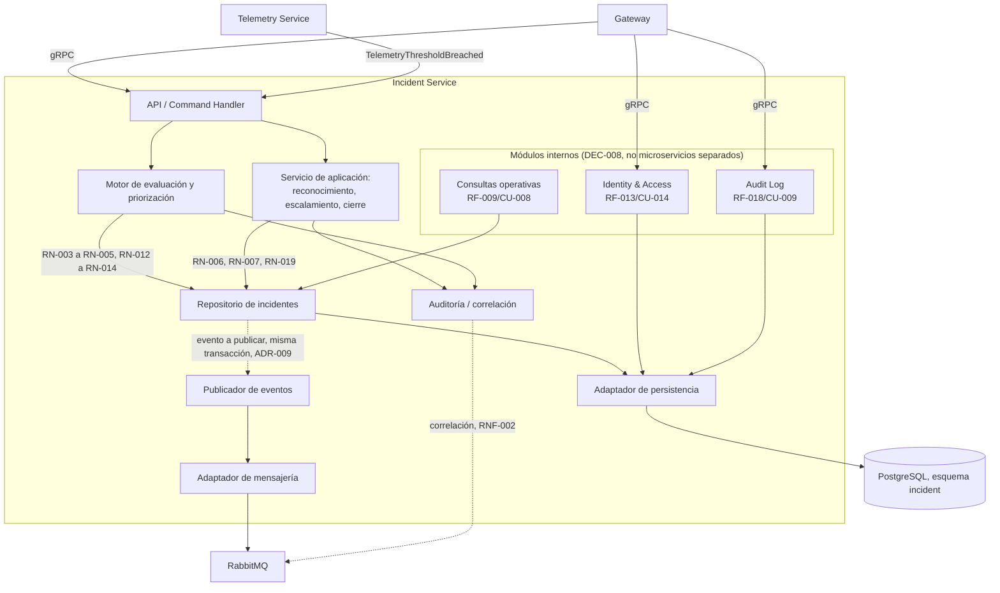

# Diagrama de componentes

Se profundiza únicamente el contenedor de mayor valor arquitectónico: **Incident Service**. Los
demás contenedores (Asset Service, Telemetry Service, Notification Service) permanecen a nivel de
contenedor (`docs/architecture/container-diagram.md`) hasta que el equipo decida profundizarlos.

Componentes **conceptuales**, con responsabilidades claras. **No se adopta arquitectura hexagonal
formal como patrón obligatorio del MVP** (DEC-008, `docs/planning/decisions-log.md`): se mantiene
separación por módulos/capas, con interfaces o puertos únicamente en los límites externos
(persistencia, mensajería, correo, observabilidad) — no se presentan clases ni paquetes Java; son
la descomposición lógica mínima necesaria para razonar sobre CU-003 a CU-006, más los tres módulos
internos adicionales descritos abajo (Identity & Access, Audit Log, consultas operativas).

## Componentes y responsabilidad

| Componente | Responsabilidad |
|---|---|
| API / Command Handler | Recibe comandos vía gRPC desde el Gateway y eventos desde Telemetry Service; los traduce a operaciones del dominio de incidente. No contiene lógica de negocio propia. |
| Motor de evaluación y priorización | Aplica RN-003 (severidad), RN-004/RN-005 (equivalencia y persistencia), RN-012 a RN-014 (impacto/urgencia/prioridad/recálculo) al crear o actualizar un incidente (CU-003). |
| Servicio de aplicación (reconocimiento, escalamiento, cierre) | Orquesta CU-004 (reconocer), CU-005 (escalar, solicitado/confirmado por el Supervisor de operaciones — sin escalamiento automático por SLA) y CU-006 (cierre técnico, exclusivo del Técnico de mantenimiento, RN-019). |
| Repositorio de incidentes | Puerto de dominio para leer/escribir el estado del incidente; oculta el detalle de persistencia al resto de los componentes. |
| Publicador de eventos | Implementa el patrón Transactional Outbox (ADR-009): el evento se registra en la misma transacción que el cambio de estado, y un proceso independiente lo publica en RabbitMQ. |
| Auditoría / correlación | Registra cada transición relevante con actor, timestamp y motivo (RN-008), propagando correlation ID (RNF-002). |
| Adaptador de persistencia | Puerto/adaptador hacia PostgreSQL (esquema `incident`, ADR-006); ports and adapters, sin acceso directo desde el resto de los componentes. |
| Adaptador de mensajería | Puerto/adaptador hacia RabbitMQ (ADR-004); usado por el Publicador de eventos. |
| Identity & Access (módulo interno) | Dueño de usuarios, roles y asignaciones de acceso (RF-013/CU-014, DEC-004); esquema lógico de persistencia propio (`identity`), accedido a través del mismo adaptador de persistencia. No es un microservicio separado (DEC-008). |
| Audit Log (módulo interno) | Consulta restringida de solo lectura de la bitácora de auditoría (RF-018/CU-009, DEC-005); esquema lógico de persistencia propio (`auditlog`). No es un microservicio separado (DEC-008). |
| Consultas operativas (módulo interno) | Atiende RF-009/CU-008 (métricas de negocio: SLA, prioridad, volumen de incidentes) leyendo del Repositorio de incidentes (DEC-006). No es un microservicio separado (DEC-008). |

## Cómo atraviesan los CU y eventos principales

| CU | Componentes que participan | Eventos |
|---|---|---|
| CU-003 (crear incidente automático) | API → Motor de evaluación y priorización → Repositorio → Publicador de eventos | `TelemetryThresholdBreached` (entrada), `IncidentCreated` (salida) |
| CU-004 (reconocer y coordinar) | API → Servicio de aplicación → Repositorio → Auditoría → Publicador de eventos | `IncidentAcknowledged` |
| CU-005 (escalar) | API → Servicio de aplicación → Repositorio → Auditoría → Publicador de eventos | `IncidentEscalated` |
| CU-006 (cerrar) | API → Servicio de aplicación → Repositorio → Auditoría → Publicador de eventos | `IncidentClosed` |

## Resuelto por decisión

- RF-013/CU-014 (gestión de asignaciones de acceso): módulo interno **Identity & Access**, dentro
  de Incident Service (DEC-004, DEC-008).
- RF-009/CU-008 (consultar métricas operativas): módulo interno de consultas operativas, dentro de
  Incident Service (DEC-006, DEC-008).
- RF-018/CU-009 (consultar bitácora de auditoría, solo lectura restringida): módulo interno
  **Audit Log**, dentro de Incident Service (DEC-005, DEC-008).
- Arquitectura hexagonal formal: **no se adopta** como patrón obligatorio del MVP (DEC-008); se
  mantiene separación por módulos/capas con puertos solo en los límites externos.

El nivel de detalle de componente de los tres módulos internos se limita a la tabla de arriba; su
descomposición en clases/paquetes es diseño técnico posterior, no bloqueado por esta decisión.

## TODO

- Componentes internos de Asset Service, Telemetry Service y Notification Service: no
  profundizados en esta fase.
- Clases y paquetes técnicos concretos de Identity & Access, Audit Log y consultas operativas:
  diseño técnico posterior.
