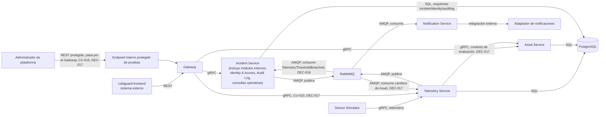

# Contenedores (C4 — Nivel 2)

Diagrama de contexto relacionado: `docs/architecture/system-context.md`. En C4, un contenedor es
una aplicación o almacén de datos en ejecución — no un contenedor Docker. Docker Compose es el
mecanismo local de ejecución previsto para estos contenedores C4, no un contenedor C4 adicional
(ver `docs/architecture/deployment-view.md`).

`Identity & Access`, `Audit Log` y el módulo de consultas operativas se representan como **módulos
internos de Incident Service**, no como microservicios separados (DEC-004, DEC-005, DEC-006,
DEC-008, `docs/planning/decisions-log.md`). No se adopta arquitectura hexagonal formal como patrón
obligatorio del MVP; se mantiene separación por módulos/capas, con puertos solo en los límites
externos (persistencia, mensajería, correo, observabilidad).

`Incident Service` no se comunica directamente con `Notification Service`: publica en `RabbitMQ`
(`IS → MQ`, AMQP) y `Notification Service` consume desde ahí (`MQ → NS`), según ADR-005
(comunicación asíncrona) y ADR-009 (Transactional Outbox para publicación confiable). Está
prohibido dibujar una flecha directa `IS → NS`.

## Contenedores, responsabilidad, tecnología, datos y protocolo

| Contenedor | Responsabilidad | Tecnología prevista | Datos que maneja | Protocolo de interacción |
|---|---|---|---|---|
| Gateway | Único punto de entrada REST; valida JWT en el borde (solo APF2, RF-015/CU-016); enruta a servicios internos vía gRPC; propaga correlación/trazas. No es un BFF: sin lógica de agregación ni reglas de negocio (ADR-008) | Java 25, Spring Boot | Tokens JWT (en tránsito, APF2); correlation ID | REST (entrante, desde `coldguard-frontend`); gRPC (saliente, hacia Asset Service, Telemetry Service e Incident Service, que también atiende Identity & Access, Audit Log y métricas); deadline por servicio, consultas con un reintento ante `UNAVAILABLE`, comandos sin reintento; cuerpos de petición acotados (413) |
| Asset Service | Activos, sensores, perfiles operativos, ciclo de vida del sensor, historial (RF-001, RF-002, RF-010 a RF-012, RF-016) | Java 25, Spring Boot | Activos, sensores, perfiles operativos, historial de ciclo de vida (esquema `asset` en PostgreSQL, ADR-006) | gRPC (entrante, desde Gateway); SQL (hacia PostgreSQL) |
| Telemetry Service | Recibe telemetría del Sensor Simulator (productor principal, vía gRPC) y de la inyección de pruebas (RF-014/CU-015, actor Administrador de plataforma, que entra por el Gateway y llega a Telemetry por gRPC, DEC-017); evalúa contra el perfil operativo (RN-001, RN-002); aplica elegibilidad de lecturas por estado del sensor (RN-017, RN-018); detecta pérdida de conectividad (RF-017/CU-022) | Java 25, Spring Boot | Lecturas de telemetría (esquema `telemetry` en PostgreSQL) | gRPC (entrante, desde Sensor Simulator, DEC-003, y desde el Gateway para CU-015 y las consultas, DEC-017); gRPC saliente hacia Asset Service (contexto de evaluación, con caché, DEC-017); eventos AMQP: publica `TelemetryThresholdBreached` y `SensorConnectivityLost`, consume los cambios de Asset que invalidan su caché (DEC-016, DEC-017); SQL |
| Incident Service | Crea, prioriza, reconoce, escala y cierra incidentes (RF-005 a RF-007); incluye tres módulos internos, no microservicios separados (DEC-008): **Identity & Access** (RF-013/CU-014, usuarios/roles/accesos, DEC-004), **Audit Log** (RF-018/CU-009, consulta restringida de solo lectura de auditoría, DEC-005) y **consultas operativas** (RF-009/CU-008, métricas de negocio, DEC-006); ver despliegue de componentes en `docs/architecture/component-diagram.md` | Java 25, Spring Boot | Incidentes (esquema `incident`); usuarios/roles/accesos (esquema lógico `identity`); registros de auditoría consultables (esquema lógico `auditlog`, sin almacenamiento inmutable/WORM) — todos en la misma instancia PostgreSQL, ADR-006 | gRPC (entrante, desde Gateway y Telemetry Service); AMQP (publica en RabbitMQ vía Outbox, ADR-009); SQL |
| Notification Service | Consume eventos desde RabbitMQ y envía notificaciones (RF-008) mediante un adaptador desacoplado de proveedor (DEC-007) | Java 25, Spring Boot | Solicitudes de notificación, estado de envío | AMQP (consume de RabbitMQ); integración externa hacia el adaptador de notificaciones |
| PostgreSQL | Persistencia transaccional; una instancia con ownership lógico de esquema por servicio (`asset`, `telemetry`, `incident`, `identity`, `auditlog`) — sin joins ni FK entre esquemas (ADR-006). Los esquemas `identity` y `auditlog` son propiedad lógica de sus módulos internos, alojados en el proceso de Incident Service | PostgreSQL | Datos de cada servicio/módulo, aislados por esquema | SQL |
| RabbitMQ | Broker de eventos para todos los workflows asíncronos cross-service (ADR-004) | RabbitMQ | Mensajes de evento (payload conceptual en `docs/domain/commands-events.md`) | AMQP |

## Fase de autenticación (APF1 vs. APF2)

En APF1 el Gateway no realiza validación real de JWT; el login de esa fase es una demostración de
frontend sin backend de seguridad (RN-016). La validación real (RF-015/CU-016, ADR-007/ADR-008)
se implementa en APF2. No se dibuja un componente adicional para esto: es una responsabilidad del
Gateway que se activa en una fase posterior, no una integración cloud ya realizada.

## Resuelto por decisión

- Protocolo de ingesta de telemetría (DEC-003): gRPC desde Sensor Simulator; la inyección de
  pruebas (CU-015) entra por una ruta REST del Gateway y llega a Telemetry por el mismo RPC
  (DEC-017).
- Servicio dueño de RF-013/CU-014, RF-009/CU-008 y RF-018/CU-009 (DEC-004, DEC-005, DEC-006):
  Identity & Access, consultas operativas y Audit Log, respectivamente.
- Granularidad de esos tres módulos (DEC-008): **módulos internos de Incident Service**, no
  microservicios separados; sin arquitectura hexagonal formal como patrón obligatorio del MVP.
