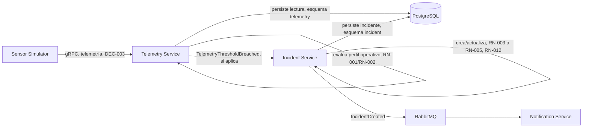
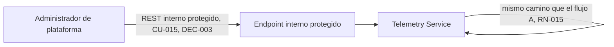

# Flujo de datos

Dos recorridos, derivados de `docs/domain/commands-events.md` y `docs/domain/domain-model.md`
("Proceso objetivo"); no agregan pasos nuevos.

## A. Telemetría del sensor-simulator hasta incidente

Solo la telemetría de un sensor en `SensorStatus = ACTIVO` continúa hacia la evaluación de
anomalías (RN-017, RN-018); la de otros estados se persiste pero no avanza hacia la creación de
incidentes.

## B. Telemetría de prueba mediante endpoint interno protegido

El actor de esta inyección es el **Administrador de plataforma** (RF-014/CU-015); el endpoint es
solo para pruebas controladas, diagnóstico y demostración — no sustituye al sensor-simulator como
productor principal (`docs/domain/use-cases.md`).

## Datos sensibles o relevantes que atraviesan estos flujos

| Dato | Dónde aparece | Naturaleza |
|---|---|---|
| Credenciales / tokens (JWT) | Gateway, en el borde (APF2) | Sensible |
| Roles de usuario | Gateway, Incident Service (módulo interno Identity & Access, DEC-004/DEC-008) | Sensible |
| Datos de telemetría (sensor, activo, valor, timestamp, correlación) | Telemetry Service | Operativo |
| Incidentes (severidad, impacto, urgencia, prioridad, causa de cierre) | Incident Service | Operativo, con datos de negocio |
| Bitácora de auditoría (actor, timestamp, motivo, valores anterior/posterior) | Todos los servicios que registran transiciones (RN-008) | Sensible (identifica actores) |
| `traceId` / `spanId` / `correlationId` | Propagados por el Gateway (RNF-002) a través de todos los servicios, vía OpenTelemetry | Operativo, no sensible |

Campos de correlación permitidos y prohibidos, y el detalle de qué se registra por señal:
`docs/operations/observability-strategy.md`.

## Controles previstos (no se afirma que existan todavía)

- **Validación de entradas**: en el Gateway y en cada servicio, sobre los datos recibidos.
- **Autenticación/autorización**: JWT + RBAC en el borde, real solo en APF2 (ADR-007, ADR-008,
  RN-016); en APF1 no hay control real de backend.
- **Cifrado en tránsito**: previsto para las comunicaciones REST/gRPC; no hay evidencia de
  configuración TLS aplicada en el MVP local.
- **Redacción de secretos y datos sensibles en telemetría**: previsto (regla ya vigente: nunca
  registrar tokens JWT, credenciales, cadenas de conexión, secretos ni payloads completos de
  telemetría en logs, trazas o eventos de negocio — `.claude/rules/security.md`,
  `docs/operations/observability-strategy.md`); no hay evidencia de una implementación
  verificada todavía.
- **Control de acceso**: por rol, a nivel de CU (ADR-007), con datos de usuarios/roles propiedad
  del módulo interno Identity & Access, dentro de Incident Service (DEC-004, DEC-008); el mapeo
  explícito rol→endpoint sigue pendiente de operacionalizar para Sprint 4/RBAC (ya señalado como
  riesgo en ADR-007 y en `docs/quality/risk-register.md`, R-014).
- **Gestión de secretos**: `.env` no versionado local, Azure Key Vault + Managed Identity
  planificado (DEC-010); ningún secreto se documenta en código, imágenes, repositorio o logs.

## TODO

Formato serializado de los mensajes (JSON, Protobuf) y esquema de tablas: diseño técnico
posterior, no definido aquí.
