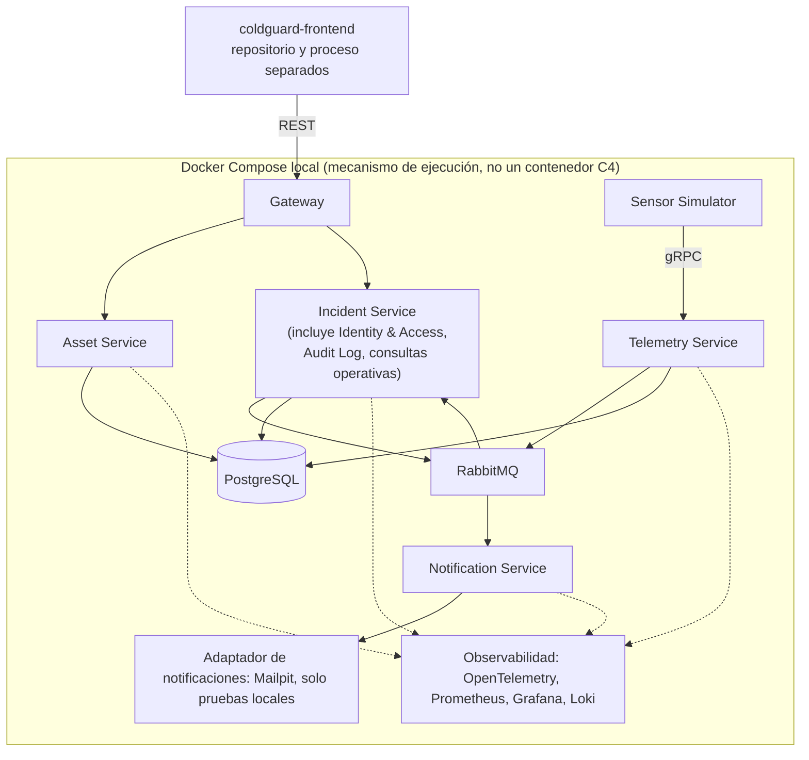
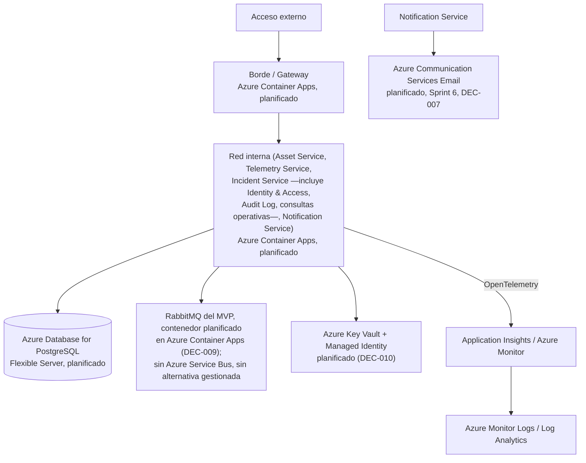

# Vista de despliegue

## A. Desarrollo local previsto (único entorno con despliegue real)

Todos los contenedores backend corren en la máquina local vía Docker Compose
(`deploy/local/docker-compose.yml`, RNF-001); `coldguard-frontend` corre por separado (repositorio
propio, ADR-002). No hay ningún servicio cloud desplegado.

Comandos de arranque en `docs/operations/runbooks.md`. La topología interna del stack de
observabilidad está definida en DEC-019 y `docs/infrastructure/docker-strategy.md`: OpenTelemetry
Collector → Tempo (trazas), scrape directo de Prometheus (métricas), Alloy → Loki (logs), todo
visualizado en Grafana (RNF-002/RNF-004).

**Secretos locales (DEC-010)**: cada servicio lee su configuración sensible desde variables de
entorno provistas por un archivo `.env` no versionado (excluido por `.gitignore`); `.env.example`
documenta las claves esperadas sin valores reales. Ningún secreto se documenta en código, imágenes
de contenedor, el repositorio o logs (`.claude/rules/security.md`).

## B. Azure planificado (cómputo, persistencia, mensajería, secretos, observabilidad y notificaciones ya precisados; resto lógico)

**Azure es el proveedor cloud objetivo** para el despliegue planificado y la presentación final
de ColdGuard (decisión confirmada); el aprovisionamiento y despliegue permanecen **pendientes de
ejecución**. DEC-002, DEC-009 y DEC-010 (`docs/planning/decisions-log.md`) precisan cómputo,
persistencia, mensajería y secretos. Observabilidad (Azure Monitor/Application Insights) y
notificaciones (Azure Communication Services Email, DEC-007) también están confirmadas como
destino/proveedor planificado.

- **Cómputo (DEC-002)**: Azure Container Apps es la plataforma planificada para el backend y el
  sensor-simulator. No hay AKS ni otro servicio de cómputo seleccionado.
- **Persistencia (DEC-002)**: Azure Database for PostgreSQL Flexible Server es la plataforma
  planificada para PostgreSQL, preservando el ownership lógico de esquema por servicio/módulo
  (ADR-006), incluidos los esquemas lógicos `identity` y `auditlog` de los módulos internos de
  Incident Service (DEC-008).
- **Mensajería (DEC-002, DEC-009)**: RabbitMQ se conserva como broker del MVP; **no** se sustituye
  por Azure Service Bus ni por ninguna alternativa de mensajería gestionada. Para la presentación
  final se desplegará como contenedor planificado dentro de Azure Container Apps.
- **Gestión de secretos (DEC-010)**: Azure Key Vault, con Managed Identity para que los servicios
  en Azure Container Apps accedan sin credenciales embebidas — planificado, no implementado. En
  local, la estrategia es `.env` no versionado + `.env.example` (Vista A).
- **Observabilidad**: Azure Monitor y Application Insights son el destino planificado de trazas,
  métricas, logs y excepciones de los servicios backend, recibidos vía exportador de
  OpenTelemetry; Azure Monitor Logs / Log Analytics es el destino planificado para consulta
  operativa de logs. Ningún dato real se envía todavía: no hay suscripción Azure operativa.
- **Notificaciones (DEC-007)**: Azure Communication Services Email es el proveedor productivo
  planificado, previsto para Sprint 6 y el despliegue final; Mailpit sigue siendo solo para
  pruebas locales (Vista A). No se afirma que el recurso Azure Communication Services esté creado
  ni que se hayan enviado correos reales.
- **Terraform**: herramienta prevista para infraestructura como código; se evaluará y, en su
  momento, se ejecutará según decisión del equipo. No se ha ejecutado `terraform apply`.
- **LocalStack**: herramienta prevista para simular servicios cloud localmente si aporta valor
  para Azure; sin evidencia de uso en el repositorio.
- Ningún recurso Azure se ha creado. Nombrar Azure Container Apps, PostgreSQL Flexible Server,
  RabbitMQ en Azure Container Apps, Azure Key Vault, Managed Identity, Azure Communication
  Services Email o Azure Monitor/Application Insights como planificados no implica suscripción
  Azure, permisos, identidades, secretos ni ningún recurso ya aprovisionado.

## Límites de seguridad y red (lógicos, no implementados)

| Límite | Descripción prevista |
|---|---|
| Acceso externo | Solo a través del Gateway; ningún servicio interno se expone directamente |
| Red interna | Servicios backend y almacenes de datos, no accesibles desde fuera del entorno local/cloud |
| Secretos | Local: `.env` no versionado + `.env.example`. Azure planificado: Key Vault + Managed Identity (DEC-010). Nunca commiteados ni registrados en logs (`.claude/rules/security.md`) |
| Persistencia / backup | Previsto (ver `docs/operations/backup-recovery-plan.md`); sin política de retención ni RPO/RTO confirmados |

## Consideraciones futuras (no implementadas, no planificadas para el MVP)

Alta disponibilidad, balanceadores de carga, múltiples zonas de disponibilidad y recuperación
ante desastres multi-región **no** están implementadas ni forman parte del alcance del MVP. Se
listan aquí únicamente como consideraciones futuras diferenciadas, no como diseño actual.

## TODO

Distribución de recursos (CPU/memoria) por contenedor y healthchecks específicos de Docker
Compose: no definidos aquí.
