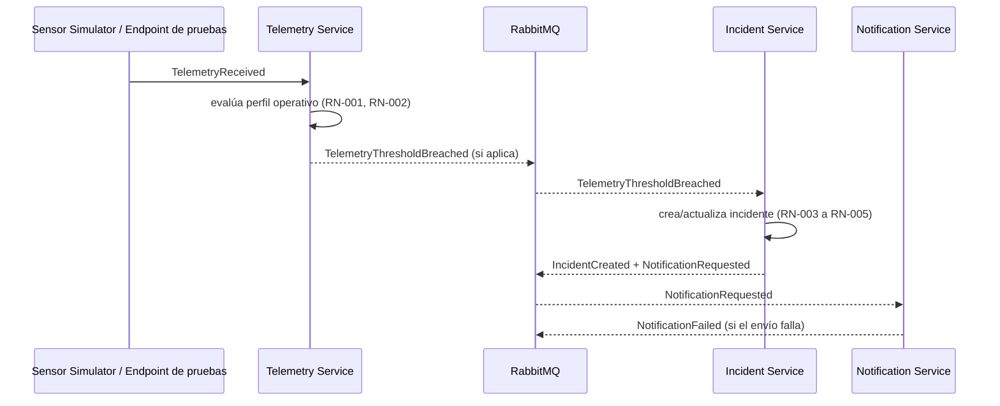
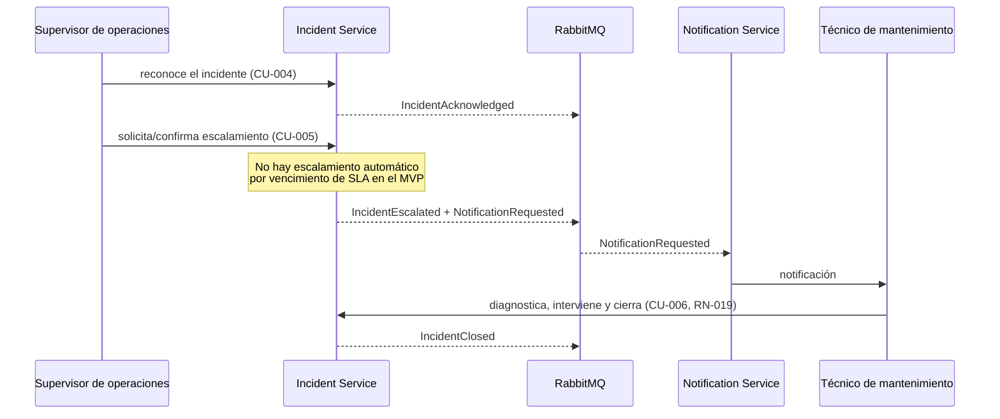
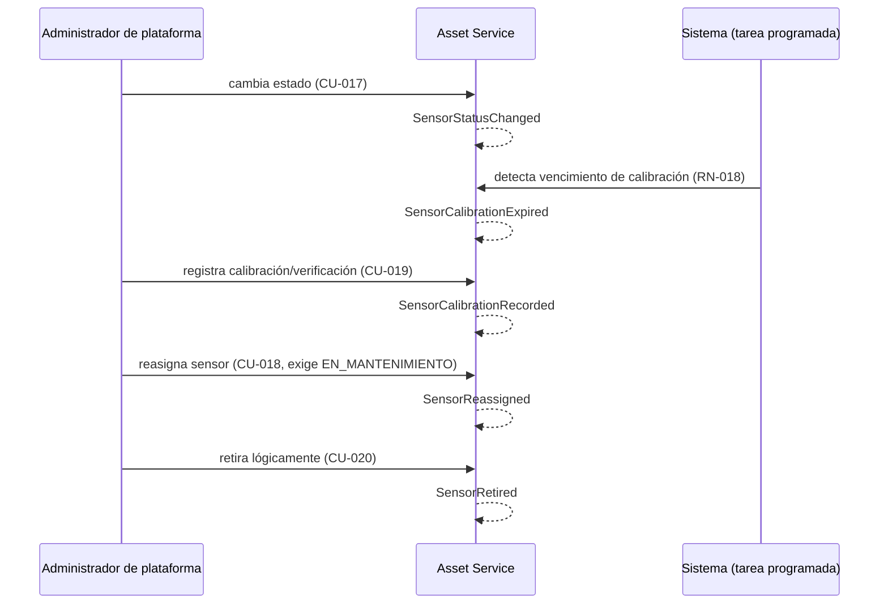

# Flujo de eventos

Todos los nombres de evento están alineados con `docs/domain/commands-events.md`, que es la
fuente de verdad del catálogo. Decisiones que respaldan este flujo: ADR-004 (RabbitMQ), ADR-005
(Incident Service → Notification Service asíncrono, vía evento, no comunicación directa), ADR-009
(Transactional Outbox para publicación confiable).

## Categorías de eventos

| Categoría | Eventos | Productor |
|---|---|---|
| Telemetría | `TelemetryReceived`, `TelemetryThresholdBreached` | Telemetry Service |
| Conectividad | `SensorConnectivityLost` | Telemetry Service, como proceso de sistema (detección por ausencia de telemetría esperada, CU-022; DEC-016) |
| Incidentes | `IncidentCreated`, `IncidentAcknowledged`, `IncidentEscalated`, `IncidentClosed` | Incident Service |
| Notificación | `NotificationRequested`, `NotificationFailed` | Incident Service (solicitud) / Notification Service (resultado) |
| Ciclo de vida del sensor | `SensorStatusChanged`, `SensorReassigned`, `SensorCalibrationRecorded`, `SensorCalibrationExpired`, `SensorRetired` | Asset Service (o Sistema, para `SensorCalibrationExpired`) |

`IncidentResolved` **no** forma parte de este catálogo: no existe una transición o estado del
incidente distinto de `IncidentClosed` que lo justifique; `IncidentClosed` es el único evento de
cierre técnico en el MVP.

`SensorConnectivityLost` es un evento **operativo**: por sí mismo **no crea un incidente
térmico** en el MVP; queda disponible para monitoreo y auditoría (RN-020).

De estos eventos, `IncidentCreated`, `IncidentAcknowledged`, `IncidentEscalated`,
`IncidentClosed` y `SensorConnectivityLost` conforman la telemetría de negocio mínima prevista
(`docs/operations/observability-strategy.md`): se registran con nombre, timestamp,
identificadores correlacionables (`traceId`, `correlationId`, y `incidentId`/`sensorId`/
`assetId` cuando corresponda) y atributos no sensibles necesarios — nunca tokens, credenciales,
cadenas de conexión, secretos ni payloads completos.

## Flujo de telemetría a incidente



`Incident Service` **no** llama directamente a `Notification Service`: publica en `RabbitMQ`, y
`Notification Service` consume desde ahí (ADR-005). Prohibido dibujar `IS → NS` directo.

## Flujo de conectividad (sin incidente automático)

```mermaid
sequenceDiagram
  participant TS as Telemetry Service
  participant Mon as Monitoreo

  TS->>TS: evalúa ausencia de telemetría esperada (RN-020)
  TS-->>Mon: SensorConnectivityLost
  Note over Mon: Visible y auditable;<br/>no crea un incidente térmico por sí solo
```

## Flujo de reconocimiento, escalamiento y cierre



## Flujo del ciclo de vida del sensor



## Consultas operativas y de auditoría (no son eventos, se mencionan por consistencia)

RF-009/CU-008 (métricas operativas) y RF-018/CU-009 (bitácora de auditoría) son **consultas**, no
eventos de dominio: no aparecen en el catálogo de arriba. Su ownership está fijado por decisión
(DEC-005, DEC-006, `docs/planning/decisions-log.md`): RF-009 mediante el módulo de consultas
operativas de Incident Service, y RF-018 mediante el módulo/servicio lógico Audit Log, que
consulta los registros de auditoría que cada servicio ya genera (RN-008) — ver
`docs/architecture/container-diagram.md`.

## TODO

Formato de mensaje, versionado y topología (exchanges, colas, dead-letter): definidos en
`contracts/events/README.md`. Los reintentos del consumidor, las DLQ y el Outbox están implementados (SPEC-003); el flujo de
reproceso está en `docs/operations/runbooks.md`.
