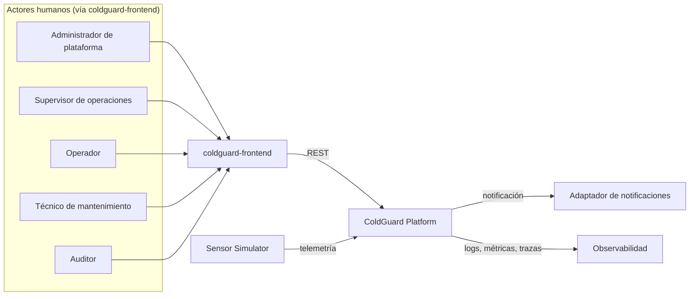

# Contexto del sistema (C4 — Nivel 1)

Diagrama de contenedores relacionado: `docs/architecture/container-diagram.md`.

## Elementos del contexto

| Elemento | Qué es | Fuente de la decisión |
|---|---|---|
| Administrador de plataforma, Supervisor de operaciones, Operador, Técnico de mantenimiento, Auditor | Actores humanos, cada uno con su propio alcance de casos de uso; todos interactúan con el sistema exclusivamente a través de `coldguard-frontend`, no directamente con el backend | `docs/product/stakeholders.md` |
| `coldguard-frontend` | Sistema cliente externo, en repositorio separado; consume el Gateway como único punto de entrada REST. No es parte de este repositorio backend | ADR-002 |
| ColdGuard Platform (`BE`) | Este repositorio: Gateway + servicios internos; ver el siguiente nivel de detalle en `docs/architecture/container-diagram.md` | ADR-001, ADR-008 |
| Sensor Simulator | Sistema externo de demostración, autónomo, productor **principal** de telemetría; sustituye sensores físicos reales en el MVP (`CU-002`). No es un sensor físico real: no hay integración con hardware de sensores en este alcance | `docs/domain/use-cases.md` |
| Adaptador de notificaciones | Integración externa abstracta para el envío de notificaciones (RF-008). En el MVP local, el adaptador confirmado para pruebas es Mailpit — no es un proveedor de correo productivo. Azure Communication Services Email es el proveedor productivo **planificado** (DEC-007), previsto para Sprint 6 y el despliegue final; no está creado ni se han enviado correos reales | `CLAUDE.md` (Technology), `docs/architecture/tech-stack.md`, `docs/planning/decisions-log.md` (DEC-007) |
| Observabilidad | Destino de logs estructurados, métricas y trazas correlacionables (OpenTelemetry, Micrometer, Prometheus, Grafana, Loki) | RNF-002, RNF-004, `CLAUDE.md` (Technology) |

## Alcance y supuestos

- **Alcance**: este diagrama representa el MVP académico ejecutándose en local. No incluye
  ningún componente cloud desplegado.
- **Supuesto**: el endpoint interno protegido de inyección de telemetría de pruebas (RF-014,
  CU-015, actor Administrador de plataforma) no aparece como actor de contexto: es un mecanismo
  interno de `BE`, no un sistema externo. Su detalle vive en
  `docs/architecture/container-diagram.md`.
- **Supuesto**: el "Adaptador de notificaciones" es una integración externa lógica; Mailpit es
  solo la opción de prueba local, y Azure Communication Services Email es el proveedor productivo
  **planificado** (DEC-007), no implementado — ver `docs/architecture/tech-stack.md`.
- **No se muestra**: el mecanismo de autenticación en el borde (Gateway valida JWT solo en APF2,
  ADR-007/ADR-008); a nivel de contexto todo el tráfico externo entra por el Gateway sin
  distinguir tráfico autenticado. En APF1 no hay validación real en el backend (RN-016).
- **No se muestra**: ningún componente cloud. El MVP corre completo en local (RNF-001,
  `.claude/rules/infra.md`). Azure es el proveedor cloud objetivo para el despliegue planificado;
  el aprovisionamiento y despliegue permanecen pendientes de ejecución — ver
  `docs/architecture/deployment-view.md`.
