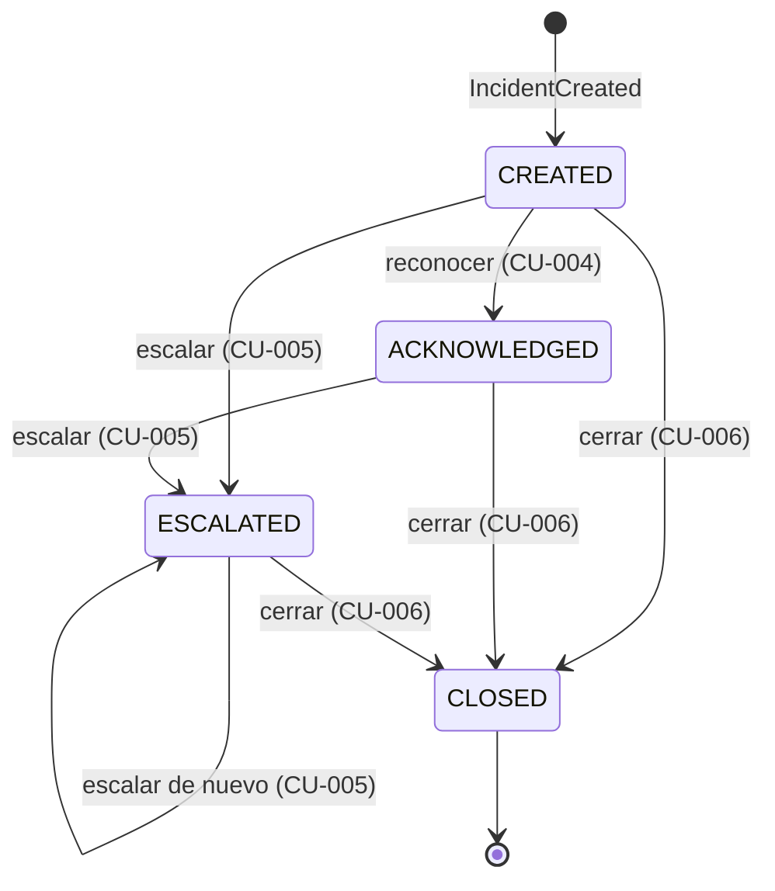
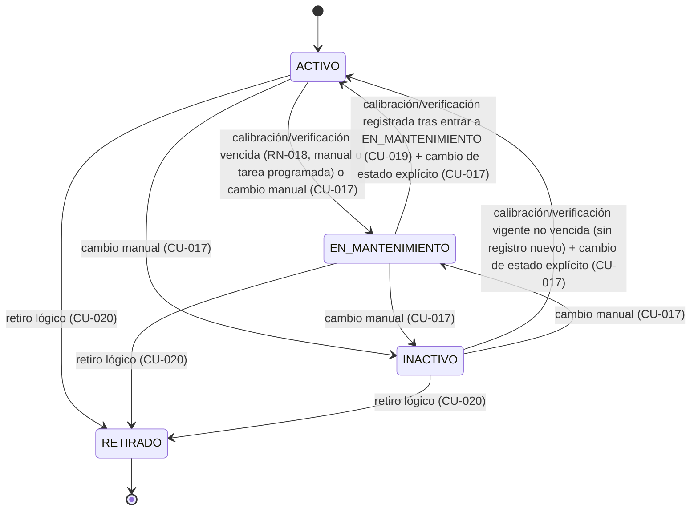

# Máquinas de estado

## Incidente

Formalizada por DEC-015 (amplía DEC-013). Estados: `CREATED`, `ACKNOWLEDGED`, `ESCALATED`,
`CLOSED`. "Abierto" (RN-004) es cualquier estado distinto de `CLOSED`. `IncidentClosed` es el
único evento de cierre técnico (no existe `IncidentResolved`).

| Transición | Guard | Regla |
|---|---|---|
| Reconocer | Una sola vez, incidente abierto; rol Supervisor de operaciones. Si ya está `ESCALATED` conserva ese estado y solo registra `acknowledged_at` | RN-006 |
| Escalar | Incidente abierto, repetible, motivo obligatorio; rol Supervisor de operaciones; nunca automático por SLA | RN-012, RN-014 |
| Cerrar | Incidente abierto, causa y comentario de resolución, rol Técnico de mantenimiento; no exige reconocimiento previo (queda fuera de MTTA) | RN-007, RN-019 |
| `CLOSED` → cualquier otro | No permitido | — |

Una nueva anomalía equivalente sobre un incidente abierto no cambia el estado: incrementa el
contador de ocurrencias y puede recalcular la prioridad, siempre auditado (RN-005, RN-014).

## Sensor

Confirmada por decisión sobre el ciclo de vida operativo del sensor (RN-017, RN-018,
`docs/product/business-rules.md`). Estados: ACTIVO, EN_MANTENIMIENTO, INACTIVO, RETIRADO.

> El sensor solo puede **reasignarse a otro activo** (`SensorAssignmentHistory`, CU-018) estando
> en EN_MANTENIMIENTO; no es una transición de estado (el sensor permanece en EN_MANTENIMIENTO
> tras reasignarse), por eso no aparece como arista en el diagrama de estados.

### Transiciones y precondiciones

| Transición | Precondición | Regla |
|---|---|---|
| Cualquier estado no terminal → EN_MANTENIMIENTO | Calibración/verificación vencida — por decisión administrativa (CU-017) o detectada por una tarea programada (actor Sistema, periodicidad configurable) — o decisión administrativa sin relación a vencimiento | RN-018, RN-017 |
| EN_MANTENIMIENTO → ACTIVO | Calibración o verificación **registrada explícitamente después de entrar a EN_MANTENIMIENTO** (CU-019) — no basta una vigente previa — y cambio de estado ejecutado explícitamente vía CU-017 (registrar la calibración, por sí sola, no reactiva) | RN-018 |
| INACTIVO → ACTIVO | Calibración o verificación **vigente y no vencida** (no se exige un registro nuevo) y cambio de estado ejecutado explícitamente vía CU-017 | RN-018 |
| Cualquier estado no terminal → INACTIVO | Decisión administrativa, con auditoría (CU-017) | RN-017 |
| Reasignación a otro activo (no es transición de estado) | Sensor en EN_MANTENIMIENTO (CU-018) | RN-017 |
| Cualquier estado no terminal → RETIRADO | Retiro lógico (CU-020); no elimina historial; sin restricción de estado de origen | RN-017 |
| RETIRADO → cualquier otro estado | **No permitido en el MVP.** RETIRADO es un estado terminal, salvo que exista una decisión futura documentada. | RN-017 |

Toda transición, sin excepción, registra usuario responsable (persona o, en la detección
automática de vencimiento, el proceso automático), fecha y hora, motivo, y valor
anterior/posterior (RN-017), y emite `SensorStatusChanged` (`docs/domain/commands-events.md`). La
detección de vencimiento que dispara una transición a EN_MANTENIMIENTO emite además
`SensorCalibrationExpired`.

### Efecto sobre la elegibilidad de lecturas

- ACTIVO: las lecturas del sensor son elegibles para evaluación de anomalías (RN-002) y para
  creación/actualización de incidentes (RN-004, RN-005).
- EN_MANTENIMIENTO, INACTIVO, RETIRADO: las lecturas se conservan como evidencia técnica, pero no
  son elegibles para esa evaluación (RN-018).

### TODO

- Periodicidad o criterio exacto de vencimiento de la calibración/verificación: debe ser
  configurable (RN-018); no se fija ningún valor numérico. Implementado como configuración
  (validez por perfil o por defecto, periodicidad de la tarea); los valores de demostración son
  placeholder académico (DEC-022).
- ~~Qué constituye una "acción equivalente documentada"~~ cuando la tarea programada detecta el
  vencimiento: resuelto por DEC-022 e implementado en SPEC-005; la tarea ejecuta la transición a
  EN_MANTENIMIENTO directamente, con el actor de sistema `calibration-expiry-job`.
- RETIRADO como estado terminal es válido "para el MVP, salvo que exista una decisión futura
  documentada" (texto literal de la decisión); no se define aquí ninguna condición de reversión.

**Resuelto en esta ronda** (ya no son TODO): INACTIVO → ACTIVO exige calibración/verificación
vigente no vencida, sin registro nuevo (distinto de EN_MANTENIMIENTO → ACTIVO, que sí exige un
registro nuevo); la detección de vencimiento puede ser automática (tarea programada, actor
Sistema) además de manual.
